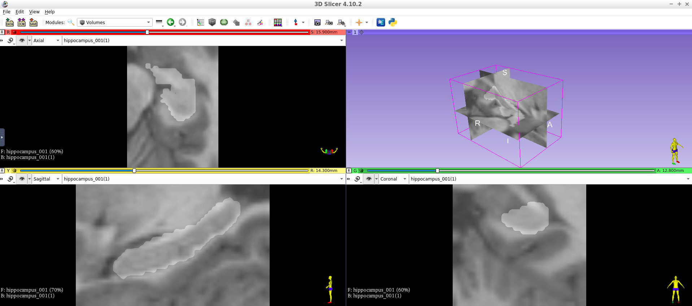
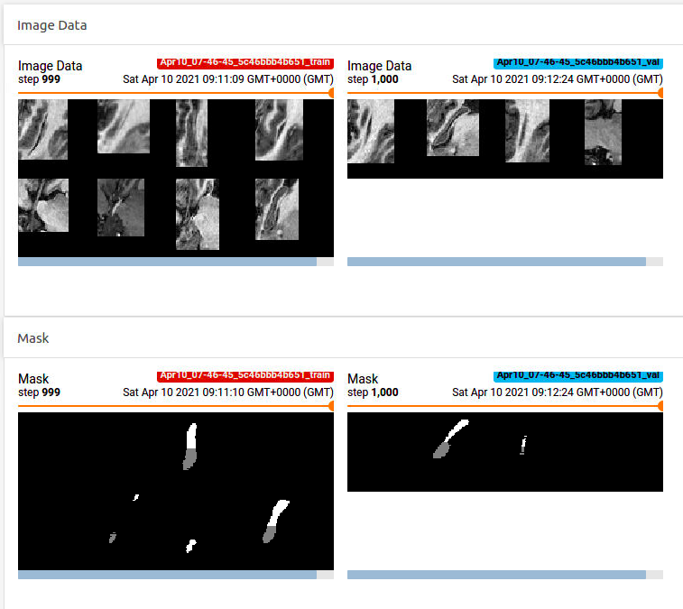
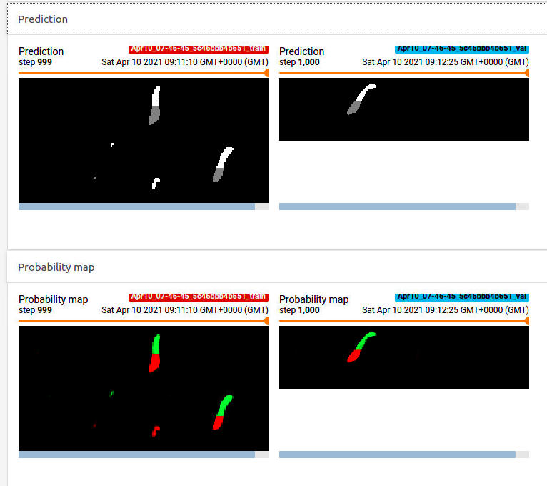

# Quantifying Alzheimer's Disease Progression Through Automated Measurement of Hippocampal Volume

This project is part of the Udacity AI for Healthcare nanodegree program.

The **Project Overview** and **Parting Words** below are taken from the starter description of the project delivered by Udacity. The **Results** section presents some of the results achieved. For more detailed outcomes please refer to the files in each section directory.

## Project Overview

### Background

Alzheimer's disease (AD) is a progressive neurodegenerative disorder that results in impaired neuronal (brain cell) function and eventually, cell death. AD is the most common cause of dementia. Clinically, it is characterized by memory loss, inability to learn new material, loss of language function, and other manifestations. 

For patients exhibiting early symptoms, quantifying disease progression over time can help direct therapy and disease management. 

A radiological study via MRI exam is currently one of the most advanced methods to quantify the disease. In particular, the measurement of hippocampal volume has proven useful to diagnose and track progression in several brain disorders, most notably in AD. Studies have shown reduced volume of the hippocampus in patients with AD.

The hippocampus is a critical structure of the human brain (and the brain of other vertebrates) that plays important roles in the consolidation of information from short-term memory to long-term memory. In other words, the hippocampus is thought to be responsible for memory and learning (that's why we are all here, after all!)

Humans have two hippocampi, one in each hemishpere of the brain. They are located in the medial temporal lobe of the brain. Fun fact - the word "hippocampus" is roughly translated from Greek as "horselike" because of the similarity to a seahorse, a peculiarity observed by one of the first anatomists to illustrate the structure.

According to [studies](https://www.sciencedirect.com/science/article/pii/S2213158219302542), the volume of the hippocampus varies in a population, depending on various parameters, within certain boundaries, and it is possible to identify a "normal" range when taking into account age, sex and brain hemisphere. 

There is one problem with measuring the volume of the hippocampus using MRI scans, though - namely, the process tends to be quite tedious since every slice of the 3D volume needs to be analyzed, and the shape of the structure needs to be traced. The fact that the hippocampus has a non-uniform shape only makes it more challenging. Do you think you could spot the hippocampi in this axial slice?

As you might have guessed by now, we are going to build a piece of AI software that could help clinicians perform this task faster and more consistently.

You have seen throughout the course that a large part of AI development effort is taken up by curating the dataset and proving clinical efficacy. In this project, we will focus on the technical aspects of building a segmentation model and integrating it into the clinician's workflow, leaving the dataset curation and model validation questions largely outside the scope of this project.

### What You Will Build

In this project you will build an end-to-end AI system which features a machine learning algorithm that integrates into a clinical-grade viewer and automatically measures hippocampal volumes of new patients, as their studies are committed to the clinical imaging archive.

Fortunately you won't have to deal with full heads of patients. Our (fictional) radiology department runs a HippoCrop tool which cuts out a rectangular portion of a brain scan from every image series, making your job a bit easier, and our committed radiologists have collected and annotated a dataset of relevant volumes, and even converted them to NIFTI format!

You will use the dataset that contains the segmentations of the right hippocampus and you will use the U-Net architecture to build the segmentation model.

After that, you will proceed to integrate the model into a working clinical PACS such that it runs on every incoming study and produces a report with volume measurements.

### The Dataset

We are using the "Hippocampus" dataset from the [Medical Decathlon competition](http://medicaldecathlon.com/). This dataset is stored as a collection of NIFTI files, with one file per volume, and one file per corresponding segmentation mask. The original images here are T2 MRI scans of the full brain. As noted, in this dataset we are using cropped volumes where only the region around the hippocampus has been cut out. This makes the size of our dataset quite a bit smaller, our machine learning problem a bit simpler and allows us to have reasonable training times. You should not think of it as "toy" problem, though. Algorithms that crop rectangular regions of interest are quite common in medical imaging. Segmentation is still hard.

## Results

### Exploratory Data Analysis

Exploratory Data Analysis involves:
* viewing exemplary images in notebook and 3D Slicer,
* investigating NIFTI files,
* calculating hippocampus volumes and plotting the distribution,
* finding outliers.

Screenshot from 3D Slicer:

### Model Training

UNet architecture is used to build the segmentation model. Metrics like Dice score, Jaccard score, Sensitivity and Specificity are implemented to evaluate the model performance.

Visualisations from Tensorboard:

### Clinical Network Integration

Clinical network in this project consists of:
* 'send_volumes.py' script which simulates sending volumes from MRI scanner to the PACS,
* Orthanc - PACS server representation,
* OHIF - viewer system,
* AI module - HippoVolume.AI which predicts the hippocampus mask on the incoming image and calculates its volume.

Screenshot from OHIF showing the final report with predicted mask and calculated volumes:

## Parting Words

If you were able to get here after completing all the tasks above - congratulations! You have gone through the challenging process of integrating knowledge of clinical context, data analysis, machine learning systems, and medical imaging networking to create a fully functional AI module for a radiological system.

Armed with this knowledge you will be able to get quickly started with a vast majority of problems in 3D radiological imaging space, and even transfer this knowledge over to non-radiological modalities that generate 3D images.

At the moment of writing in 2020, medical imaging AI is a very rapidly growing space, and the potential of the field is staggering. We are only starting to get access to good clinical datasets, the ImageNets of medical imaging is yet to come, clinician researchers are just starting to wrap their heads around what is possible with machine-learning-based technology and tools are becoming better every day. Information flow between data scientists and clinicians is key to unlocking the potential of medical AI and helping clinicians reduce the amount of mundane work, become more precise, efficient, and less stressed. This is just the beginning.

### Useful links

If you are curious to learn more about the space and see what others are doing, here are a few useful resources, companies and societies to watch for.

#### Conferences and professional societies

* [MICCAI Society](http://www.miccai.org/) hosts an annual conference dedicated to medical imaging and related fields, and also hosts a number of challenges. One that has consistently generated good volumetric datasets is called [BRATS](http://braintumorsegmentation.org/)
* [Radiological Society of North America](https://www.rsna.org/) is a renowned organization that unifies medical imaging professionals around the globe. In addition to hosting the eponymous largest medical imaging conference in the world it has been turning more attention to AI recently, and hosted interesting medical imaging competitions within its "[AI challenge](https://www.rsna.org/en/education/ai-resources-and-training/ai-image-challenge)" program. Last year's challenged featured a classification problem for CT imaging (although with the focus on 2D methods)
* [SIIM](https://siim.org/page/meetings) is a society that focuses on medical imaging informatics and it has recently started running a machine learning sub-conference called C-MIMI

#### Academia

It wouldn't be much of an overstatement to say that almost every academic medical center in the world is running some sort of a medical imaging AI program. These are all very interesting since they are rooted in clinical expertise and benefit from access to data. They vary in size and often are a part of larger, disease-specific programs. A couple efforts worthy of noting are:

* [Center for Clinical Data Science](https://www.ccds.io/) by Parthers Healthcare
* [Stanford's AIMI](https://aimi.stanford.edu/)
* [National Consortium of Intelligent Medical Imaging](https://www.medsci.ox.ac.uk/research/networks/national-consortium-of-intelligent-medical-imaging), kicked off by the University of Oxford and the UK's National Health Service

#### Startups

There are plenty and there will be more. Some choose to pursue a clinical workflow, some focus on application of particular machine learning technique and some capitalize on existing clinical footprint and invest in platforms that accelerate others' efforts. Some established players are:

* [Cortechslabs](https://www.cortechslabs.com/) - focuses on quantitative analysis of brain images. Of particular note is the software called [Neuroquant](https://www.cortechslabs.com/products/neuroquant/) which uses deep learning to produce reports with MRI-based volumetric measurements of structures inside brain that are related to age-related neurodegenerative disorders such as Alzheimer's. Sounds familiar? :)
* [Mirada Medical](https://mirada-medical.com/) - Oxford-based company that advanced a field of radiation oncology with its deep-learning-based segmentation models
* [Arterys](https://www.arterys.com/) - Silicon Valley startup that was the first to obtain an FDA clearance for a deep learning medical imaging suite for oncology.
* [Enlitic](https://www.enlitic.com/) - San Francisco-based company aiming at diagnostic use cases that accelerate radiologic workflow
* [Nuance](https://www.nuance.com/healthcare/diagnostics-solutions/ai-marketplace.html) is a Boston-based company that produces a well established platform of choice for radiological dictation. Recently the company focused a lot of effort on a marketplace for medical imaging AI solutions where startups that do not quite have Nuance's reach can deploy their software.
* [Terarecon](https://www.terarecon.com/envoyai/exchange) - similarly to Nuance, this Californian company started in core diagnostic radiology and expanded with an AI marketplace offering branded "EnvoyAI"

#### Big Tech

Some big cloud providers are eyeing the space closely, and running their own programs and projects related to medical imaging.

* Microsoft Research has a [project dubbed InnerEye](https://www.microsoft.com/en-us/research/project/medical-image-analysis/) that for the past 10+ years has been exploring the use of machine learning for a variety of medical imaging applications. One of the instructors of this course had the honor of spending a significant part of his career as a team member here.
* Google DeepMind is a group within Google doing some cutting-edge AI research, including [some work on medical imaging](https://deepmind.com/blog/article/ai-uclh-radiotherapy-planning). We can credit them with the contribution to the invention of the U-net which has been prominently featured in this course.

## License

This project is licensed under the MIT License.
